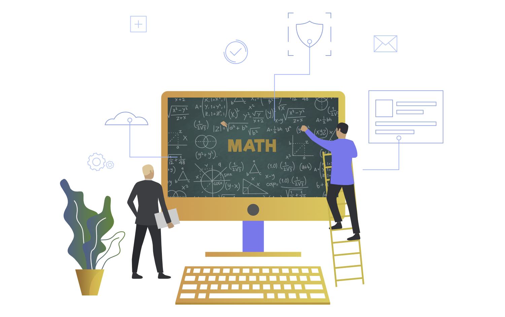

# Mathematics

**Mathematics**  has been the bane of many students’ lives (including mine!!!) since arguably it’s inception. On the other hand,  **Computer Science**  is quite interesting and students study it in hopes of becoming the next programming whizz-kid!!! But hold on…is it really that simple?!! No, my friends, it isn’t….Computer Science is in fact quite closely linked to Mathematics.\
For many years, there has been much debate about the Importance of Mathematics in Computer Science. Some believe that it adds only little value in Computer Science while others (mostly in the majority!) think it is the foundation on which Computer Science is built.

**_According to the University of Oxford:_**
>_Mathematics is a fundamental intellectual tool in computing, but computing is also increasingly used as a key component in mathematical problem-solving._

### Why is Mathematics so important in Computer Science?
1. Discrete Mathematics is the Foundation of Computer Science.
2. Mathematics Teaches the Usage of Algorithms.
3. Mathematics Provides the Analytical Skills Required in Computer Science.
4. Mathematical Concepts are Required in many Disciplines of Computer Science

### Types of mathematics used in Computer Science-

| S. No.       | Type            |
|--------------|-----------------|
| 1.           | Binary Math     |
| 2.           | College Algebra |
| 3.           | Statistics      |
| 4.           | Calculus        |
| 5.           | Discrete Math   |

## Reference
For reference, click [here](https://www.geeksforgeeks.org/what-is-the-importance-of-mathematics-in-computer-science/) 